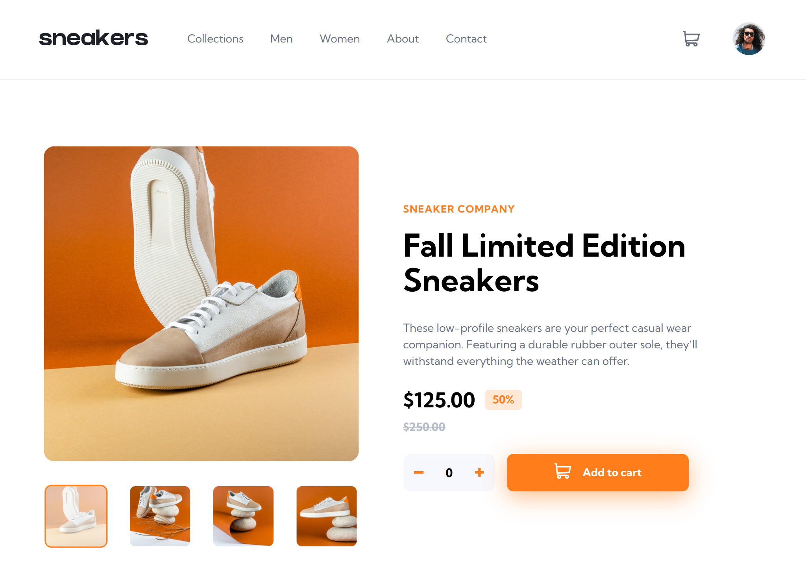

# Frontend Mentor - Product preview card component solution

This is a solution to the [Ecommerce Product Page challenge on Frontend Mentor](https://www.frontendmentor.io/challenges/ecommerce-product-page-UPsZ9MJp6). Frontend Mentor challenges help you improve your coding skills by building realistic projects.

## Table of contents

- [Overview](#overview)
  - [The challenge](#the-challenge)
  - [Screenshot](#screenshot)
  - [Links](#links)
- [My process](#my-process)
  - [Built with](#built-with)
- [Author](#author)

## Overview

### The challenge

Users should be able to:

- View the optimal layout for the site depending on their device's screen size
- See hover states for all interactive elements on the page
- Open a lightbox gallery by clicking on the large product image
- Switch the large product image by clicking on the small thumbnail images
- Add items to the cart
- View the cart and remove items from it

### Screenshot

### Links

- Solution URL: [https://www.frontendmentor.io/solutions/blogr-landing-page-with-css-flexbox-L1LbjfwzDD](https://www.frontendmentor.io/solutions/blogr-landing-page-with-css-flexbox-L1LbjfwzDD)
- Live Site URL: [https://blogr-one.vercel.app/](https://blogr-one.vercel.app/)

## My process

### Built with

- Semantic HTML5 markup
- Sass (SCSS)
- CSS Flexbox
- Vanilla Javascript
- Parcel (Build tool)

## Author

- Frontend Mentor - [@heyitspieter](https://www.frontendmentor.io/profile/heyitspieter)
- Twitter - [@heyitspieter](https://www.twitter.com/heyitspieter)
